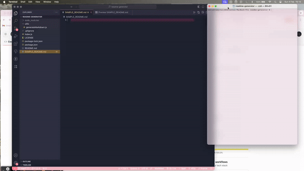

  # Readme Generator
  ## Bootcamp: Module 11 Challenge
  
  The README Generator streamlines the creation of professional README files for your projects. With an easy-to-use command-line interface, it prompts you for your project's details and automatically generates a well-structured README.md file. This tool is perfect for developers looking to save time while maintaining a high standard of project documentation.
  
  ## Table of Contents
  - [Installation](#installation)
  - [Usage](#usage)
  - [Credits](#credits)
  - [Tests](#tests)
  - [License](#license)
  - [Questions](#questions)
  
  ## Installation
  To get started with the README Generator, clone the repository to your local machine. Open your terminal, navigate to the project's directory, and run npm install to install all required dependencies. This setup prepares the tool for use in any project.
  
  ## Usage
  To use the README Generator, simply run node index.js from your command line in the project directory. Follow the prompts to input your project's information, such as title, description, installation instructions, and more. Once completed, the tool will generate a README.md file tailored to your project, ready to be added to your repository.

  

  A walkthrough video is available [here](https://drive.google.com/file/d/1GjFPZf1cVw5aTDHwTZLoiFi7hsHXuAzE/view).
  
  ## Tests
  Testing the README Generator is straightforward. Run npm test to execute the test suite, ensuring all functionalities work as expected. For custom tests, add your test cases to the test directory.

  ## Credits
  Developed using insights gained from class learnings and the [Node.js](https://nodejs.org/docs/latest/api/) documentation.

  ## License
  MIT License

  Copyright (c) [2024] [AdriannaDerkacz]

  Permission is hereby granted, free of charge, to any person obtaining a copy of this software and associated documentation files (the "Software"), to deal in the Software without restriction, including without limitation the rights to use, copy, modify, merge, publish, distribute, sublicense, and/or sell copies of the Software, and to permit persons to whom the Software is furnished to do so, subject to the following conditions:

  The above copyright notice and this permission notice shall be included in all copies or substantial portions of the Software.

  THE SOFTWARE IS PROVIDED "AS IS", WITHOUT WARRANTY OF ANY KIND, EXPRESS OR IMPLIED, INCLUDING BUT NOT LIMITED TO THE WARRANTIES OF MERCHANTABILITY, FITNESS FOR A PARTICULAR PURPOSE AND NONINFRINGEMENT. IN NO EVENT SHALL THE AUTHORS OR COPYRIGHT HOLDERS BE LIABLE FOR ANY CLAIM, DAMAGES OR OTHER LIABILITY, WHETHER IN AN ACTION OF CONTRACT, TORT OR OTHERWISE, ARISING FROM, OUT OF OR IN CONNECTION WITH THE SOFTWARE OR THE USE OR OTHER DEALINGS IN THE SOFTWARE.

  ## Questions
  For questions, please contact me at a.derkacz@gmail.com.
  GitHub: [adriannaderkacz](https://github.com/adriannaderkacz).
  